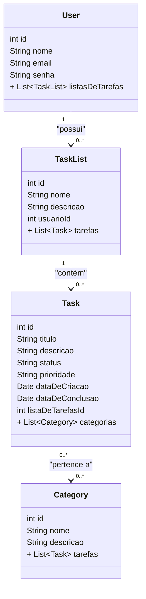

## Diagrama de classe

```mermaid
classDiagram
    class User {
        int id
        String nome
        String email
        String senha
        + List~TaskList~ listasDeTarefas
    }

    class TaskList {
        int id
        String nome
        String descricao
        int usuarioId
        + List~Task~ tarefas
    }

    class Task {
        int id
        String titulo
        String descricao
        String status
        String prioridade
        Date dataDeCriacao
        Date dataDeConclusao
        int listaDeTarefasId
        + List~Category~ categorias
    }

    class Category {
        int id
        String nome
        String descricao
        + List~Task~ tarefas
    }

    %% Relacionamentos
    User "1" --> "0..*" TaskList : "possui"
    TaskList "1" --> "0..*" Task : "contém"
    Task "0..*" --> "0..*" Category : "pertence a"
```
